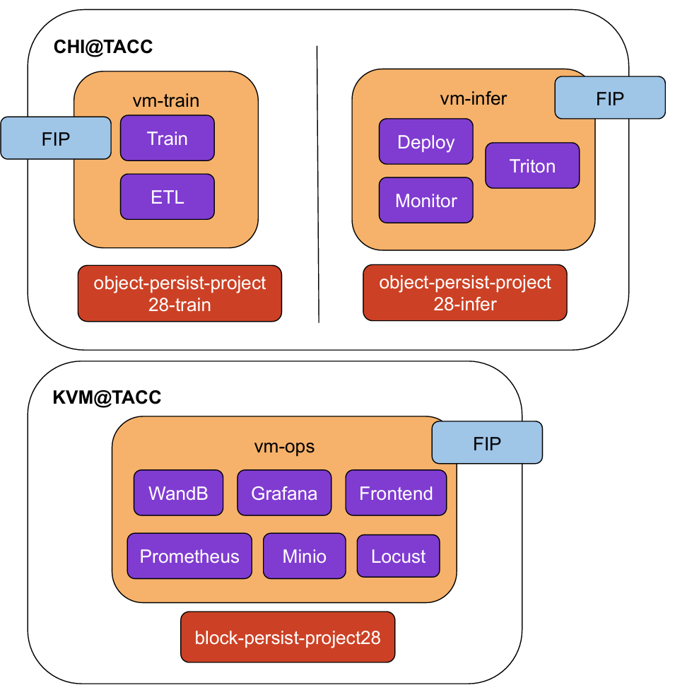

# MLops: Info Lens 👓 - Automatic News Classification, Content Summary, True and False Identification

## Ⅰ.Value Proposition
A cloud-deployed machine learning operation system that are designed for automatic and quick-response news content extraction. 

The system is aimed at benefiting any user or professional journalist who wants to process news information efficiently through 3 functions:
- [x] **News Content Summary**
- [x] **Identification**: True / Fake 
- [x] **News Category Classification**: Business/Politics/Food & Drink/Travel/Parenting/Style & beauty/Wellness/World news/Sports/Entertainment

The system is **expected** to achieve a total of tens of milliseconds of reasoning time for three functional responses per request, avoiding the high cost of time-consuming and requiring professional processing and verification when compared to traditional non-ML businesses. Besides, the system **will be** host at least dozens of API calls per second, which makes business efficiency significantly higher than traditional services.

The overall system is judged by the following **business** metric: 
- Feedback from users: average satisfaction per batch(for content summary); average accuracy per batch(for identification & classification)
- System: response error rate, average inference delay, resource utilization

## Ⅱ.Contributors

| Name             | Responsible for                   | Link to their commits in this repo               |
|------------------|-----------------------------------|--------------------------------------------------|
| Team: Coconut 🥥 | Project Proposal & Report |https://github.com/YunchiZ/ECE-GY-9183-Project.git|                                    
| Haorong Liang 👩‍🚀 | ETL: Data Pipeline                |https://github.com/YunchiZ/ECE-GY-9183-Project/commits/main/?author=Haorong0726|
| Yunchi  Zhao  🐱‍👤 | Model Training                    |https://github.com/YunchiZ/ECE-GY-9183-Project/commits/main/?author=YunchiZ|
| Ziyan   Zhao  🤠 | Model Serving & Monitoring        |https://github.com/YunchiZ/ECE-GY-9183-Project/commits/main/?author=ArcusNYU|
| Tianqi  Xia   🏂 | Monitor & Continous X Pipeline |                                    |


## Ⅲ.System diagram

<!-- Overall digram of system. Doesn't need polish, does need to show all the pieces. 
Must include: all the hardware, all the containers/software platforms, all the models, 
all the data. -->




## Ⅳ.Summary of outside materials

<!-- In a table, a row for each dataset, foundation model. 
Name of data/model, conditions under which it was created (ideally with links/references), 
conditions under which it may be used. -->

| Outside Materials|Name  |Scource | Conditions of use | 
|--------------|--------------------|-------------------|-----------------|
| Data set 1   | CNN_Dailymail      |https://huggingface.co/datasets/abisee/cnn_dailymail| For training BART on Content Summary task |
| Data set 2   | Xsum               |https://huggingface.co/datasets/EdinburghNLP/xsum| For training BART on Content Summary  task |
| Data set 3   | News Category Dataset |https://www.kaggle.com/datasets/setseries/news-category-dataset | For training DistilBERT on Classification task |
| Data set 4   | WELFake Dataset |https://www.kaggle.com/datasets/saurabhshahane/fake-news-classification | For training XLNet on Identification task |
| Model 1 | pre-trained BART   |https://huggingface.co/facebook/bart-large-cnn | Fine-tuned on CNN_Dialymail & Xsum for Content Summary |
| Model 2 | pre-trained DistilBERT   |https://huggingface.co/distilbert/distilbert-base-uncased | Fine-tuned on News Category Dataset for Classification |
| Model 3 | pre-trained XLNet | https://huggingface.co/xlnet/xlnet-base-cased | Fine-tuned on WELFake Dataset for identification |


## Ⅴ.Summary of infrastructure requirements

<!-- Itemize all your anticipated requirements: What (`m1.medium` VM, `gpu_mi100`), 
how much/when, justification. Include compute, floating IPs, persistent storage. 
The table below shows an example, it is not a recommendation. -->
| Requirement     | How many/when                                     | Justification |
|-----------------|---------------------------------------------------|---------------|
| `m1.xlarge` VMs  | 1 for entire project duration                    |a. Running 10 dockers concurrently b. Model training and API on 3 PLMs c. Model & Dataset Size|
|`KVM@TACC` instances| 1~4 for entire project duration                   | Environment construction & Docker development test|
| `compute_gigaio`/`rtx_6000`/     | 1 for any type and 6 hour block twice a week | Early-stage dev. and test. on Train & Deploy dockers|
|`compute_liqid`/`p100_nvlink`| 1 for any type and 6 hour block twice a week |Middle and final stage project test and validation|
| Floating IP | 1~4 for entire project duration | IP required for any instance created |
| Instance Snapshot | 2~3 for each team member | Just private instance images, not important|

## Ⅵ.Detailed design plan

<!-- In each section, you should describe (1) your strategy, (2) the relevant parts of the 
diagram, (3) justification for your strategy, (4) relate back to lecture material, 
(5) include specific numbers. -->

### 1.Model training and training platforms

<!-- Make sure to clarify how you will satisfy the Unit 4 and Unit 5 requirements, 
and which optional "difficulty" points you are attempting. -->
We aim to build and optimize large-scale models for three natural language processing (NLP) tasks:

+ Text Summarization: Generating summaries for long articles.
+ Text Classification: Categorizing news articles into predefined categories (e.g., politics, sports, health).
+ Fake News Detection: Classifying news articles as "real" or "fake" based on the content.

For each task, we will select appropriate pre-trained models, fine-tune them, and evaluate the impact of various training strategies, particularly for large models, using distributed training to optimize training time and resource efficiency.


#### 1). Model Selection: 
    - Task 1: Summary Generation
        - We plan to use pre-trained BART model provided by Hugging Face. (https://huggingface.co/facebook/bart-large-cnn)

        ```python 
        from transformers import AutoTokenizer, AutoModelForSeq2SeqLM

        model_name = "facebook/bart-large-cnn" 
        tokenizer = AutoTokenizer.from_pretrained(model_name)
        model = AutoModelForSeq2SeqLM.from_pretrained(model_name)
        ```
        - Processing of input text: Before entering the text into the BART model, the text needs to be tokenized. A Hugging Face's word tokenizer automatically converts the text into a format the model can understand.

        ```python 
        inputs = tokenizer([article], max_length=1024, truncation=True, return_tensors="pt")
        ```

        - Generating summary: Once the input text is processed and ready, it can be passed to the BART model to generate a summary.

        ```python 
        summary_ids = model.generate(inputs['input_ids'], num_beams=4, max_length=150, early_stopping=True)
        summary = tokenizer.decode(summary_ids[0], skip_special_tokens=True)
        ```

        - Parameters setting: 
            - num_beams: Controlling the width of the beam search, higher values can produce higher quality summaries, but the computational cost will increase
            - max_length: Controls the maximum length of the generated summary
            - length_penalty: Length penalties when generating summaries to help avoid generating summaries that are too long or too short
            - temperature: Used to control randomness when generating summaries, lower values generate summaries that are more certain and higher values generate summaries that are more random.
        
        - Evulation: The quality of the model-generated summaries can be evaluated using a common text summary evaluation metrics, ROUGE.

    - Task 2: Classify
        - We plan to use pre-trained DistilBERT model provided by Hugging Face. (https://huggingface.co/distilbert/distilbert-base-uncased)

        ``` Python
        model_name = "distilbert-base-uncased"
        tokenizer = AutoTokenizer.from_pretrained(model_name)
        model = AutoModelForSequenceClassification.from_pretrained(model_name, num_labels=n)
        ```

        - Processing of input text: we can use the tokenized summary generated during task 1, or tokenize it again.

        ``` Python
        inputs = tokenizer(text, return_tensors="pt", padding=True, truncation=True, max_length=512)
        ```

        - Processing of labels: create a map of the expected ids to their labels with id2label and label2id

        - Parameters setting:
            - warmup_steps
            - weight_decay
            - per_device_train_batch_size
            - per_device_eval_batch_size
            - logging_dir

    - Task 3: Fake news detection
        - We plan to use pre-trained XLNet model provided by Hugging Face. (https://huggingface.co/xlnet/xlnet-base-cased)

        ```Python
        model_name = "xlnet-base-cased"
        ```

        - Preprocess: 

        ``` Python
        dataset = Dataset.from_dict(data)
        ```

        - Processing of input text: we can use the tokenized summary generated during task 1, or tokenize it again.

        ``` Python
        inputs = tokenizer(text, return_tensors="pt", padding=True, truncation=True, max_length=512)
        ```

        - Parameters setting:
            - warmup_steps
            - weight_decay
            - per_device_train_batch_size
            - per_device_eval_batch_size
            - logging_dir
    
#### 2). Training Strategies: 
For training these large models, especially with large datasets, we will use some strategies to ensure both efficiency and scalability. The strategies will address both model fine-tuning and large-scale training jobs that may not fit on a low-end GPU.
    - Fine-Tuning with Pre-trained Models: We will fine-tune the models using task-specific data, starting from the pre-trained versions available in Hugging Face’s Transformers library. This approach leverages transfer learning to adapt models to the specific tasks while benefiting from pre-trained weights, which reduces the time and computational cost.

    - Batch Size Adjustments: We will explore different batch sizes and evaluate their effect on training time and model performance. We may adjust the batch size based on the GPU memory available.

    - Gradient Accumulation: If the model does not fit on the available GPU memory with a large batch size, we will use gradient accumulation. This allows us to simulate a larger batch size by accumulating gradients over multiple mini-batches before performing an update.

    - Mixed Precision Training: We will use mixed precision training to speed up training and reduce memory usage. By using 16-bit floating point operations instead of 32-bit, we can significantly reduce training time without compromising model accuracy.

#### 3). Distributed Training
    - Data Parallelism: We will use Distributed Data Parallel (DDP) for distributed training. DDP works by splitting the dataset across multiple devices, where each GPU processes a subset of the data, and gradients are averaged across all GPUs at each step.

    - Fully Sharded Data Parallel: FSDP divides model parameters and optimizes them in parallel across multiple GPUs, helping to minimize memory overhead and improve scalability for models that don’t fit into the memory of a single GPU.

#### 4). Training Time Evaluation: 
We will conduct experiments to evaluate the effect of distributed training strategies (DDP vs. FSDP) and batch size on training time.

    - Experiment Design: 
        - Single GPU vs. Multiple GPUs: We will measure the training time for a given model with one GPU and compare it to training on multiple GPUs (e.g., 1, 2, 4 GPUs).

        - FSDP vs. DDP: We will compare training with DDP and FSDP, looking at training time and model performance.

        - Batch Size and Training Time: We will vary the batch size to identify the optimal batch size for training efficiency.
    
    - Metrics:
        - Total Training Time: The total time it takes to complete model training.

        - Speed-up Factor: The ratio of training time using one GPU to training time using multiple GPUs.

        - Model Performance: Accuracy, F1 score, and loss for each strategy to ensure that the performance is not sacrificed for speed.

#### 5). Experiment Tracking with MLFlow
We will deploy MLFlow on a Chameleon node and use its logging capabilities to track metrics such as training loss, validation accuracy, model parameters, and other relevant artifacts. MLFlow will provide the ability to track experiments, compare results, and visualize model performance over time.

    - Integration with Training Code
    ``` Python
    mlflow.log_param("batch_size", 32)
    mlflow.log_param("learning_rate", 0.0001)

    mlflow.log_metric("train_loss", train_loss)
    mlflow.log_metric("val_accuracy", val_accuracy) 

    mlflow.pytorch.log_model(model, "model")
    ```

#### 6). Scheduling Training Jobs with Ray

    - Ray Cluster Setup: We will provision a Ray cluster on Chameleon, which will consist of several nodes (each with one GPU) to handle parallel training jobs.

    - The Ray cluster will be configured with the necessary resources, such as CPU cores, GPU devices, and storage, for efficient model training.

    - We will configure checkpointing to store model progress in remote storage, enabling recovery in case of failure.

    - Integration with Training Code:
    ``` Python
    import ray
    from ray import train
    from ray.train import Trainer

    trainer = Trainer(
        model=model,
        train_data=train_data,
        eval_data=eval_data,
        config=config
    )
    
    trainer.fit()

    trainer = train.tune.trainable(train_model)
    trainer.fit()
    ```

#### 7). Hyperparameter Tuning with Ray Tune
    - Define search space: We will define the search space for hyperparameters such as learning rate, batch size, optimizer type, etc.

    - Run tuning jobs: Ray Tune will schedule multiple training jobs with different hyperparameter configurations, evaluating each configuration's performance.

    - Stop early: Ray Tune’s early stopping feature will terminate underperforming trials, making the tuning process more efficient.

    - Integration with Training Code:
    ``` Python
    from ray import tune

    search_space = {
        "learning_rate": tune.loguniform(1e-5, 1e-3),
        "batch_size": tune.choice([16, 32, 64]),
        "optimizer": tune.choice(["adam", "sgd"]),
    }

    tune.run(
        train_model, 
        config=search_space,
        num_samples=10,
        resources_per_trial={"cpu": 1, "gpu": 1},
        name="hyperparameter_tuning"
    )
    ```

### 2.Model serving and monitoring platforms

<!-- Make sure to clarify how you will satisfy the Unit 6 and Unit 7 requirements, 
and which optional "difficulty" points you are attempting. -->

### 3.Data pipeline

<!-- Make sure to clarify how you will satisfy the Unit 8 requirements,  and which 
optional "difficulty" points you are attempting. -->

We design a modular and scalable data pipeline to support three tasks in our system across both offline training and online inference stages. 
The pipeline integrates persistent storage, structured logging (via SQLite), batch ETL processes, and online feedback handling.

#### 1). Persistent Storage

   
   We mount persistent volumes on Chameleon to store long-lived information. The data volume layout is shown as follows:
      
   ```
   /mnt/monitor-data/ # General data storage (utilized by ETL and online service modules)
   ├── original/         # Raw Kaggle data
   │   └── dataset.csv
   |
   ├── etl_output/       # Cleaned train/dev/test splits
   │   ├── train.jsonl
   │   ├── val.jsonl
   │   └── test.jsonl
   │   └── database.json
   |
   ├── production_data/
   │ └── logs.sqlite     # Online inference logs (SQLite DB)
   |
   └── lock_state/
     └── lock.json       # Retrain coordination lock
   ```
   ```
   /mnt/train-data/ # A dedicated data volume for the model training container (shared by the train/deploy containers)
   ├── data/ # copy version of etl_output (For training)
   │   ├── train.jsonl
   │   ├── val.jsonl
   │   └── test.jsonl
   │   └── database.json
   │
   ├── models/                          
   │   ├── BERT-0.pth             # The stored model after each training         
   │   ├── model_status.json      # Record the current state of model：serving / candidate / abandon
   │   ├── training_record.json   # Record the metrics like hyper-parameter, loss, accuracy for each epoch
   │   └── off_evaluation.json    # Record the offline evaluation result
   ```

#### 2). Offline Data
   
   We use **Kaggle News Category Datasheet** as the original datasheet.

   `etl.py` is used for pipeline which performs:

   - Cleaning (remove empty and abnormal data)
   - Normalization (lowercasing, punctuation cleanup)
   - Category Filtering (remove rare classes)
   - Train/dev/test Spliting 
   - Export to .jsonl format

   The processsed data is save to `/mnt/data/etl_output/` and synced to `/mnt/train-data/data/` for training.

#### 3). ETL Data Pipeline

   The data pipeline is structured into the following components:

   ```
   data_pipeline/
   ├── extract.py      # Load raw CSV
   ├── filter.py       # Clean text
   ├── transform.py    # normalize text
   ├── split.py        # Create dataset splits
   ├── load.py         # Save processed data as JSONL
   └── etl.py          # Main pipeline controller (calls the above modules)
   ```

   When running `etl.py`：

   - Load raw data: The ETL script reads the original dataset (e.g., from /mnt/data/original/dataset.csv).
   - Clean and split the data: It performs preprocessing steps such as lowercasing, removing invalid entries, and splitting into train/validation/test sets.
   - Save preprocessed file: The cleaned and split data is saved in JSONL format as:
     ```
     /mnt/data/etl_output/train.jsonl  
     /mnt/data/etl_output/dev.jsonl  
     /mnt/data/etl_output/test.jsonl
     ```
   - Generate dataset metadata: The script produces a metadata file describing the dataset structure, stored as: `/mnt/data/etl_output/database.json`

#### 4)Online Data

   To emulate real-time usage of our deployed service, we implement an online data pipeline that simulates user behavior and continuously generates inference requests. The simulated data is generated based on the following characterisrtics:
   - Input format: Each data point consists of a single short news description, tipically 15-50 words, without any labels.
   - Topical Diversity: The simulated inputs are sampled across different categories to simulate the broad distribution of user interests.
   - User Tracking: Each request is tagged with a psedo UserID to allow simulation of per-user performance analysis and long-term feedback tracking.
   - Request Frequency: The simulator send the request every 1-3 seconds, to simulate the low to medium traffic production load.

     
The path is shown as follows:
   ```
   simulation/
   ├── simulate_online_stream.py
   ```

   Each request is sent to the deployed model API and the input/output is logged in a shared SQLite database at: `/mnt/data/production_data/logs.sqlite`
   This database stores structured online inference logs, which include:
   - Input content (e.g., news description)
   - Predicted outputs (summary, category, fake news status)
   - Model version
   - Timestamps and latency
     
   These records are:
   - Queried by the monitor container for analysis and drift detection
   - Used by the retraining pipeline to extract fresh data for model updates
   - Visualized via dashboards for team insight
     
Using SQLite ensures efficient high-frequency writes, structured queries, and lightweight integration across all containers.

#### 5)Interactive data dashboard

   We implement a Streamlit dashboard for real-time data insights, pulling data directly from `logs.sqlite`. Dashboard features includes:
   - Class distribution histogram
   - Input length distribution
   - Inference latency trends
   - Model version usage tracking

The dashboard runs as a dev-side tool, so that we can run the dashboard locally. It refreshes on an interval to read the new data from `logs.sqlite`.

### 4.Continuous X

<!-- Make sure to clarify how you will satisfy the Unit 3 requirements,  and which 
optional "difficulty" points you are attempting. -->


