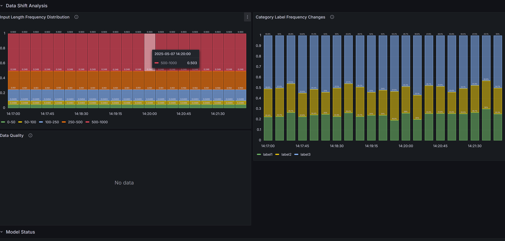
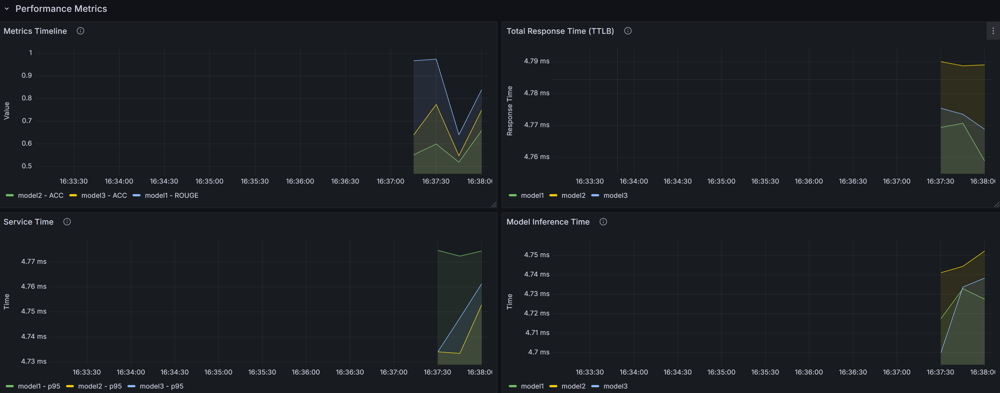

# MLops: Info Lens 👓 - Automatic News Classification, Content Summary, True and Fake Identification

## I. Value Proposition

This MLOps platform is designed for new media or self-media companies that conduct secondary creation of news on streaming platforms, such as BuzzFeed in New York. It provides a fast and efficient platform for news text summarization, classification, and veracity detection, thereby saving time spent on the initial stage of daily operations—namely, news information organization.

-   [x] **News Content Summary**
-   [x] **Identification**: True / Fake
-   [x] **News Category Classification**: Business/Politics/Food & Drink/Travel/Parenting/Style & beauty/Wellness/World news/Sports/Entertainment

<!-- The system is **expected** to achieve a total of tens of milliseconds of reasoning time for three functional responses per request, avoiding the high cost of time-consuming and requiring professional processing and verification when compared to traditional non-ML businesses. Besides, the system **will be** host at least dozens of API calls per second, which makes business efficiency significantly higher than traditional services. -->

[Frontend Interface Example](https://timothyxia9.github.io/infolens_serve/)

### 1. Raw Data

-   **Mainstream News Websites:** Original news text data from sources such as CNN.
-   **Social Media Platforms:** Real-time information streams from channels like Twitter or Facebook.
-   **Labeled Historical News:** Previously reviewed news content with veracity labels, used for model training and evaluation.

These raw data sources flow into the MLOps platform via bulk upload (to `object storage`) or through frontend actions (API requests and user feedback). The platform currently supports bulk uploads in CSV format.

### 2. Deployment Plan

-   **Cloud Deployment:** To facilitate collaboration among BuzzFeed's globally distributed content teams, the system is deployed on public cloud platforms such as AWS or GCP.
-   **Web Interface:** Provides a user-friendly web interface for content teams to upload news data and view automated processing results.
-   **Automated Model Updates:** The platform supports both scheduled and administrator-triggered model retraining and deployment, ensuring that processing capabilities keep improving with new data and that algorithms remain state-of-the-art.
-   **Logging and Monitoring:** Real-time dashboards in Grafana and backend logging systems are integrated throughout the deployment process for effective issue tracking and performance optimization.

### 3. Evaluation Plan

-   **Feedback Collection:** BuzzFeed editorial teams manually review and provide real-time feedback on summaries, including selecting the correct label via a dropdown menu in the frontend.
-   **Model Performance Evaluation:** The MLOps backend continuously matches model outputs with user feedback, enabling ongoing performance monitoring and visualization in Grafana.
-   **A/B Testing and Canary Deployment:** The details of these mechanisms will be elaborated in the latter part of this document.

<!-- A cloud-deployed machine learning operation system that are designed for automatic and quick-response news content extraction.  -->
<!-- The system is aimed at benefiting any user or professional journalist who wants to process news information efficiently through 3 functions: -->
<!-- The overall system is judged by the following **business** metric:  -->
<!-- - Feedback from users: average satisfaction per batch(for content summary); average accuracy per batch(for identification & classification) -->
<!-- - System: response error rate, average inference delay, resource utilization -->

---

## II. Contributors

| Name             | Responsible for                   | Link to their commits in this repo                                              |
| ---------------- | --------------------------------- | ------------------------------------------------------------------------------- |
| Team: Coconut 🥥 | Project Proposal & Report         | https://github.com/YunchiZ/ECE-GY-9183-Project.git                              |
| Haorong Liang 👩‍🚀 | ETL: Data Pipeline                | https://github.com/YunchiZ/ECE-GY-9183-Project/commits/main/?author=Haorong0726 |
| Yunchi Zhao 🥷   | Model Training                    | https://github.com/YunchiZ/ECE-GY-9183-Project/commits/main/?author=YunchiZ     |
| Ziyan Zhao 🤠    | Model Serving & Monitoring        | https://github.com/YunchiZ/ECE-GY-9183-Project/commits/main/?author=ArcusNYU    |
| Tianqi Xia 🏂    | Monitoring & Continous X Pipeline | https://github.com/YunchiZ/ECE-GY-9183-Project/commits/main/?author=TimothyXia9 |

## III. Scale

### 1. Task Data & Training Time

| Task Name      | Dataset Size (GB) | Training Time (hrs) |
| -------------- | ----------------- | ------------------- |
| Classification | 15.72 MB          | 0.33 hrs/epoch      |
| Fake News      | 233.77 MB         | 1 hrs/epoch         |
| Summarization  | 302.6 MB          | 1.5 hrs/epoch       |

### 2. Model & Deployment Scale

| Model Name     | Architecture | Inference Requests / Hour |
| -------------- | ------------ | ------------------------- |
| Classification | DistilBERT   | 3000 / hour               |
| Fake News      | XLNet        | 3000 / hour               |
| Summarizer     | BART (base)  | 3000 / hour               |

## IV:Cl -Continuous Integration

### 1. Cloud Native

### 2. Infrastructure as Code

All 3 VMs are configurated with scripts and services are deployed with docker compose. In the shell [infer](https://github.com/YunchiZ/ECE-GY-9183-Project/blob/main/vm-infer.sh), [train](https://github.com/YunchiZ/ECE-GY-9183-Project/blob/main/vm-train.sh), [ops](https://github.com/YunchiZ/ECE-GY-9183-Project/blob/main/vm-ops.sh), bucket or block volume are mounted, all dependencies are installed, including the docker engine, Nvidia Toolkit(if needed).
Then all services are started with docker compose configurations [infer](https://github.com/YunchiZ/ECE-GY-9183-Project/blob/main/vm-infer.yaml), [train](https://github.com/YunchiZ/ECE-GY-9183-Project/blob/main/vm-train.yaml), [ops](https://github.com/YunchiZ/ECE-GY-9183-Project/blob/main/vm-ops.yaml), which will build dockers with dockerfiles respectively.

## V. Data process

### Persistent Storage

We use two types of storage:

1. Two object storage space to store the raw datasheets, model weights, tokenizers and offline evaluation code.
2. One block storage space to store the service that run on VM instance.

**Object Storage 1**: object-persist-project28-train located at CHI@TACC. VM can bind the bucket by run this script: [script](https://github.com/YunchiZ/ECE-GY-9183-Project/blob/main/mount_object_store_train.sh).The total size is 3.60GB. After mount it with VM-training, the folder structure is shown as follows:

```
/mnt/object/                             # General data storage shared by train and ETL container
├── models/                              # Pre-saved Hugging Face hub images
│   ├── bart_source                      # News summary task
|   ├── bert_source                      # News classification task
|   └── xln_source                       # True/Fake News task
|
├── etl_data/                            # Training datasheets and online evaluation datasheets
│   └── task1_data
|        └── summary_train.csv
│   └── task2_data
|        └── welfake_train.csv
│   └── task3_data
|        └── classification_train.csv

```

**Object Storage 2**:object-persist-project28-infer located at CHI@TACC. VM can bind the bucket by run this script: [script](https://github.com/YunchiZ/ECE-GY-9183-Project/blob/main/mount_object_store_infer.sh).The total size is 4.85GB. The bucket is used to store the inference model, tokenizer and data to simulate online user request. After mount it with vm-infer, the folder structure is shown as folllows:

```
/mnt/object/                             # General data storage for inference
├── models/                              # Pre-saved Hugging Face hub images
│   ├── BART                             # News summary task
|   ├── BERT                             # News classification task
|   └── XLN                              # True/Fake News task
|
├── eval_data/                           # Online data to simulate user requests
│   ├── summary_eval.jsonl               # News summary task
|   ├── welfake_eval.jsonl               # News classification task
|   └── classification_eval.jsonl        # True/Fake News task

|
├── on_tests/                            # Stored tokenizer used for inference task
│   ├── bart_source
│   ├── bert_source
│   └── xln_source

```

**Block Storage**: We use one block storage to store the monitor data volumes for Minio, wandb and load testing results.VM can bind this volume by running this script:[script](https://github.com/YunchiZ/ECE-GY-9183-Project/blob/main/mount_block_store.sh).The total size is expanded when running the system. After mount it with vm-ops, the folder structure is shown as follows:

```
/mnt/block/                             # General data storage
├── minio_data/                         # folder to save minio logging files
|
├── wandb_data/                         # folder to save wandb logging files
|
├── on_test/
│   ├── locustfile.py                   # ???改路径
│   └── sample.jsonl                    # datasheet for load testing


```

### Offline Data

There are three datasheets in out task.

1. CNN_Dailymail dataset is used for summarision. It contains news articles (from 2007–2015) and their human-written highlights, which are concatenated into summaries. The data was collected from Wayback Machine archives and preprocessed using the PTBTokenizer (lowercasing, punctuation normalization). Each sample simulates how a news service summarizes articles for readers. In production, summaries may not be immediately available, and later feedback (e.g., user clicks) could serve as ground truth for improvement.

2. HuffPost News Category Dataset called News Category Datasheet (2012–2018), containing 45,500 news headlines evenly distributed across 10 categories such as Business, Politics, Wellness, and Entertainment. Each class includes exactly 4,500 samples. The dataset is derived from the original Kaggle dataset and modified to be beginner-friendly by removing noise and balancing class distribution. Each sample represents a real HuffPost article headline and its topic label. In production use (e.g., news apps or recommender systems), ground truth categories may come from editorial tags. User engagement (e.g., click-through rate) could later provide weak supervision signals.

3. WELFake dataset is used in true/fake identification task, which consists of 72,134 labeled news articles: 35,028 real and 37,106 fake. The dataset merges four well-known sources (Kaggle, McIntire, Reuters, BuzzFeed Political) to ensure diversity and avoid overfitting. The data includes article titles and full text, labeled as 0 (fake) or 1 (real). Each sample simulates a user-posted or shared news item. In production, articles may arrive unlabeled and require human verification. Ground truth labels (fake/real) are binary and often only available after manual fact-checking or crowdsourcing.

The sample input and output is shown as follows:

| Outside Materials | Name                  | Sampel Input 1                                                                                                                         | Sampel Input 2                                                                                                  | Sample Output                                                                 |
| ----------------- | --------------------- | -------------------------------------------------------------------------------------------------------------------------------------- | --------------------------------------------------------------------------------------------------------------- | ----------------------------------------------------------------------------- |
| Data set 1        | CNN_Dailymail         | LONDON, England(Reuters)-- HarryPotter star Daniel Radcliffe gains accessto a reported ￡ 20million fortune as heturns 18 on Monday... | NAN                                                                                                             | Harry Potter starDaniel Radeliffe gets ￡ 20M fortune as heturns 18 Monday... |
| Data set 2        | News Category Dataset | Resting is part of training. I'veconfirmed what I sortof already knew: I'mnot built for runningstreaks...                              | NAN                                                                                                             | WILLNESS                                                                      |
| Data set 3        | WELFake Dataset       | L4W ENFORCEMENT ONHIGH ALERT FollowingThreats Against Cops4nd whites On 9-11By#BlackLivesMatter And#FYFq11 Terrorists                  | RCEMENT ON HIGH ALERT Following Threats Against Cops4nd whites On 9-11By#BlackLivesMatter And#FYF911 Terrorists | 1                                                                             |

### Data Pipeline

Raw data is downloaded from Kaggle & Hugging face and stored in object storage (object-persist-project28-train and object-persist-project28-eval) for training and online evaluation, while the datasheet for load testing is stored in block sotrage.
The model is split into training & test and evaluation data using the fixed random seed. [Raw Data](https://github.com/YunchiZ/ECE-GY-9183-Project/tree/Data-pipeline/raw_process)

Pre-processing of the raw datasheet includes merging the title and body text into a single input field, drop the NAN value, cleaning invalid characters and saving the processed data for model consumption. The clean version of processed training data is store in object storage and could be read by train docker at the starting stage. [Online-Data-Pipeline](https://github.com/YunchiZ/ECE-GY-9183-Project/blob/Data-pipeline/data_pipeline/etl_app.py)

The online evaluation data is read from MinIO by monitor container's auto trigger or manager's trigger manually[Trigger](https://github.com/YunchiZ/ECE-GY-9183-Project/blob/f49a7bfce85137d94fd3fd56e0fe6fc2301ddf98/data_pipeline/etl_app.py#L223). Then the container would download evaluation.db file. Next is the preprocess of data including dropout NAN and duplicate values. Finally, the data would be append to the existing .csv file and trigger the train container to retrain the model.

### Data Dashboard



## VI. MODEL TRAINING

### 1) BART

The goal of this task is to generate a summary from a longer article. The task is framed as a sequence-to-sequence (seq2seq) learning problem, where a transformer-based model learns to map input text (articles) to output text (summaries).

#### Inputs

-   The model receives news articles (string) as input.
-   Each article is tokenized and truncated to a maximum length of 1024 tokens using the BartTokenizer.

#### Outputs

-   The target output is a summary string associated with the article.
-   During training, summaries are also tokenized and truncated to a maximum of 128 tokens.
-   During evaluation, the model generates summaries, which are compared to the ground truth using ROUGE metrics.

#### Why BART

1. Pretrained for sequence-to-sequence tasks
2. Performs well even with limited fine-tuning data
3. Helps users quickly determine if a news article is helpful before reading the full text.

### 2) DistilBERT

The goal of this task is news topic classification. Given a short description of a news article, predict which category it belongs to. This helps users quickly filter the type of content they are interested in before reading the full summary or assessing credibility.

#### Inputs

-   The model receives short news description (string) as input.
-   The text is tokenized using DistilBertTokenizerFast

#### Outputs

-   The output is a categorical class label representing the topic of the news article
-   Labels are encoded using LabelEncoder and returned as integer class indices

#### Why DistilBERT

1. Lightweight and fast
2. Efficient inference makes it suitable for large-scale and real-time applications
3. Provides categories to help users filter by their interests

### 3) XLNet

The goal of this task if to identify fake news. This helps users assess the credibility of news content before engaging further.

#### Inputs

-   A concatenated title + body of a news article (string).
-   Preprocessed using XLNetTokenizer, with truncation and padding to a maximum of 256 tokens.

#### Outputs

-   0: fake news
-   1: real news

#### Why XLNet

1. XLNet uses a permutation-based training objective, enabling better modeling of context than BERT
2. Ideal for fake news detection, efficient to find nuanced language and indirect cues that indicate fake news

### 4) Model Training

1. Summary: [summary_app.py](./train/summarize/summary_app.py)
2. Classification: [classification_app.py](./train/classification/classification_app.py)
3. Fakenews: [fakenews_app.py](./train/fake/fakenews_app.py)

### 5) Experiment Tracking

1. All training experiments in this project are tracked using Wandb [Wandb login](./train/summarize/summary_app.py#L274), each train will be named as [Model name + version + datetime](./train/summarize/summary_app.py#L91)
2. For each experiment, Wandb log the following key metrics:
    - [Summary](./train/summarize/summary_app.py#L149): lr, rouge1, rouge2, rougeL
    - [Classification](./train/classification/classification_app.py#L110): lr, accuracy, f1
    - [Fakenews](./train/fake/fakenews_app.py#L122): lr, accuracy, f1

### 6) Scheduling Training Jobs

Training jobs in this project are scheduled by HTTP API service, built using Flask and deployed in a containerized environment. This service exposes a "/train" endpoint, which can be called by etl to start model training.

-   After receiving request from ETL, the three models will be trained [in sequence](./train/app.py#L34)

### 7) Training Strategies

#### Ray Tune

This project use [Ray Tune](./train/summarize/summary_app.py#L334) for hyperparameter tuning, and use [Grid Search](./train/summarize/summary_app.py#L311), [resource allocation](./train/summarize/summary_app.py#L337) and [custom training function](./train/summarize/summary_app.py#L326) to tune more efficiently.

#### LoRA

To reduce training time and memory usage in Summary Task, this project uses [LoRA](./train/summarize/summary_app.py#L334) for fine-tuning the BART model. - Training time decreased from 1.5 hours to 50 mins by testing on 10000 sample data.

## VII. Model Serving

### 1. API Specification

The API section of this project consists of two parts: the [deploy](https://github.com/YunchiZ/ECE-GY-9183-Project/blob/01415b72a28fc3ed5e261d652e750d2773a725f9/vm-infer.yaml#L30) container and the Triton container.  
The deploy container not only manages the core tasks of model deployment, but also serves as a lightweight backend for the frontend. Under the FastAPI framework, the container exposes the actual API endpoint of the project via the [predict](https://github.com/YunchiZ/ECE-GY-9183-Project/blob/a4822059e5ccfd3cf58a70763aa673a71510df4a/deploy/app.py#L616) route.  
The required input is a JSON object in the format specified by [PredictIn](https://github.com/YunchiZ/ECE-GY-9183-Project/blob/a4822059e5ccfd3cf58a70763aa673a71510df4a/deploy/app.py#L599), which must include the `prediction_id` generated by the frontend and the user-input news text `text`.  
Both the frontend and backend enforce that `prediction_id` must be a positive integer, and `text` must be a string with a length between 50 and 12,000 characters (approximately corresponding to 10–1,000 words).  
The API wraps the information into an HTTP request as needed by Triton inference, checks and re-packages the results, and returns them in the format specified by [Response](https://github.com/YunchiZ/ECE-GY-9183-Project/blob/a4822059e5ccfd3cf58a70763aa673a71510df4a/deploy/app.py#L724), which is also a JSON object containing the provided `prediction id` and the inference results `pred_text` from three models.  
The following table directly shows the API input and output specifications:
| API | Json | Spec. |
|------------------|-----------------------------------|--------------------------------------------------|
| Input | {“prediction_id”: int, "text": str} | constr length 50~12000 |  
| Output|{"prediction_id": int, "bart": str, "xln": int, "bert": int} | xln_int: 0~1, bert_int: 0~9 |

Among the results returned by the API, since XLN performs identification, its return values are two types of numbers. Meanwhile, as BERT's classification includes 10 categories, its return values range from 0 to 9. After these results are collected and analyzed by the front end, they will be directly displayed in different Windows of the UI interface as 1) the summarized text 2) True/False 3) the actual category name.

### 2. User-specific Requirements

-   **Low latency:** API response time should be <1 second to ensure smooth editor workflow.
-   **Scability:** The system should handle up to dozens of concurrent requests because during breaking news events, the system will experience a peak in customer traffic.
-   **RESTful API** The model must be accessible via a simple RESTful API so that it can be easily integrated into BuzzFeed’s existing editorial tools.
-   **Monitoring:** Real-time monitoring of API TTLB and service time for each single model.
-   **Availability:** Automatic restart when the service is on failure.

### 3. Model Optimization

-   **ONNX Model**
    After offline training and evaluation, models are [exported](https://github.com/YunchiZ/ECE-GY-9183-Project/blob/314175cf4d5b3c37edd413bae4c4c36bf7929e50/train/summarize/summary_app.py#L184) to the ONNX format. This enables optimized inference using ONNX Runtime, which provides significant speedup over native frameworks.
-   **Batching Optimization**
    Triton enables dynamic batch processing, [configured](https://github.com/YunchiZ/ECE-GY-9183-Project/blob/main/model_config/BART/config.pbtxt) via `config.pbtxt` as batch = 4, which allows multiple inference requests to be grouped and processed simultaneously. This significantly improves GPU utilization and overall throughput.

### 4. System Optimization

-   **Triton Inference Server Integration:**  
    Our deployment leverages NVIDIA [Triton](https://github.com/YunchiZ/ECE-GY-9183-Project/blob/01415b72a28fc3ed5e261d652e750d2773a725f9/vm-infer.yaml#L9) Inference Server, which is specifically designed for production-scale model serving. It provides native support for high concurrency, dynamic batching, and multi-model management, allowing the system to efficiently utilize GPU resources and scale to handle large volumes of inference requests.

-   **FastAPI + Uvicorn for API Layer:**  
    The API layer is built with FastAPI and powered by Uvicorn, an asynchronous server. This enables high-performance, non-blocking request handling and supports multi-threaded execution, which further increases API throughput and reduces response times.

-   **Resource Monitoring & Observability:**  
    Visualized monitoring is implemented using Grafana dashboards. Key metrics—including per-model inference latency ([service time](https://github.com/YunchiZ/ECE-GY-9183-Project/blob/e14a42de5edf910c6a227e0530387f6793656958/deploy/app.py#L741)), overall API Time-To-Last-Byte ([TTLB](https://github.com/YunchiZ/ECE-GY-9183-Project/blob/e14a42de5edf910c6a227e0530387f6793656958/deploy/app.py#L129)), and [current](https://github.com/YunchiZ/ECE-GY-9183-Project/blob/e14a42de5edf910c6a227e0530387f6793656958/deploy/app.py#L211) model status & deployment stages. This enables real-time insight into system performance and internal serving status.

### 5. Offline Evaluation

To ensure that trained models meet a minimum quality before deployment, we implement an offline test by using pytest. This test is integrated into the training pipeline and automatically evaluates the models after each run. Models will only be expported as ONNX when pass the offline tests.

**Business-specific Evaluation**

-   For summary, customer focuses on its text accuracy - ROUGE.
-   For identification, customer focuses on its judging accuracy, since it is a binary classification, we use F1-score directly.
-   For classification, customer also mainly focuses on accuracy.

#### 1) Task1 - Summary

[Test logic](https://github.com/YunchiZ/ECE-GY-9183-Project/blob/main/train/summarize/tests/test_model_eval.py) for trained BART model:

-   `test_dataset` and `latest_model_path` are saved automatically during training.
-   The [evaluate_model_rouge](https://github.com/YunchiZ/ECE-GY-9183-Project/blob/e14a42de5edf910c6a227e0530387f6793656958/train/summarize/tests/eval_model.py#L15) utility computes ROUGE-1, ROUGE-2, and ROUGE-L.
-   If ROUGE-L < 0.2, the test fails, and the model is not promoted to deployment.

#### 2) Task2 - Identification

[Test logic](./train/fake/tests/test_model_eval.py) for XLNet model:

-   `test_dataset` and `latest_model_path` are saved automatically during training.
-   The model is evaluated using [evaluate_model_f1](https://github.com/YunchiZ/ECE-GY-9183-Project/blob/e14a42de5edf910c6a227e0530387f6793656958/train/fake/tests/eval_model.py#L5).
-   The test fails if F1 is below 0.85.

#### 3) Task3 - Classification

[Test logic](./train/classification/tests/test_model_eval.py) for trained XLNet model:

-   `test_dataset`, `test_labels` and `latest_model_path` are saved automatically during training.
-   The model is evaluated using [evaluate_model_accuracy](https://github.com/YunchiZ/ECE-GY-9183-Project/blob/e14a42de5edf910c6a227e0530387f6793656958/train/classification/tests/eval_model.py#L9).
-   The test fails if accuracy is below 0.7.### 6. Load Test

-   **Full API Load Test**
    To assess the end-to-end performance of the deployed API, [Locust](https://github.com/YunchiZ/ECE-GY-9183-Project/blob/8cb63098983cc0441fb9744dc9b2f988848c7dc2/vm-ops.yaml#L68) is employed, an open-source load testing tool. The [test](https://github.com/YunchiZ/ECE-GY-9183-Project/blob/main/deploy/locustfile.py) simulates multiple concurrent users by sending randomized text samples to the `/predict` endpoint at variable intervals. Key performance metrics such as request throughput, latency, and failure rates are collected during various test scenarios, including baseline, stress, and burst load patterns.

### 6. Load Test

-   **Full API Load Test**
    To assess the end-to-end performance of the deployed API, [Locust](https://github.com/YunchiZ/ECE-GY-9183-Project/blob/8cb63098983cc0441fb9744dc9b2f988848c7dc2/vm-ops.yaml#L68) is employed, an open-source load testing tool. The [test](https://github.com/YunchiZ/ECE-GY-9183-Project/blob/main/deploy/locustfile.py) simulates multiple concurrent users by sending randomized text samples to the `/predict` endpoint at variable intervals. Key performance metrics such as request throughput, latency, and failure rates are collected during various test scenarios, including baseline, stress, and burst load patterns.

-   **Model-level Load Test**
    For model-specific performance evaluation, we use the NVIDIA Triton `perf_analyzer` tool. Model-level load test is operated when the trained model passes the offline evaluation and is downloaded from minIO `candidate` bucket by `deploy` docker. This [tool](https://github.com/YunchiZ/ECE-GY-9183-Project/blob/0e37252556e123ba2111d62f999f5f951becdfe5/deploy/Triton.py#L124) realizes evaluation under varying batch sizes and concurrency levels. By using through different configurations, we measure metrics such as 95th percentile latency (P95) and throughput to ensure each model can meet predefined service-level objectives.

## VIII. Staged Deployment

Initially, the first model that meets the metric requirements is tagged as the "serving" model. When a new model completes training, it goes through the following deployment process:

-   Shadow Stage:

    The new model is tagged as "shadow" and treated as a "candidate" model
    The shadow model receives the same data as the serving model for testing
    The system collects samples until reaching a predetermined critical threshold (critical_sample)
    The system compares the average metrics of the candidate and serving models
    The candidate model advances to the canary stage only if its average metric exceeds the serving model's metric by a specific threshold (t[index])
    If performance is poor or the error rate exceeds thresholds, the model is deprecated and all traffic reverts to the serving model

-   Canary Stage:

    The canary model receives a portion of actual traffic for testing
    The system evaluates multiple metrics, including error rate, response time, etc.
    If the error rate exceeds the threshold at any point, the system immediately rolls back to the serving model
    After collecting sufficient samples, the system checks performance metrics again

-   Canary to Serving:

    If canary testing is successful and performance metrics remain better than the original model, the new model is tagged as "serving"
    The previous serving model is deprecated
    The system migrates the candidate model's metric records to the serving model position
    All traffic is routed to the new serving model

All stage transitions are protected with thread locks to ensure consistency. Models' status will be updated and maintained to be consistent with deploy docker.

## IX. Data Monitoring

### Online evaluation/Close the loop

Models are evaluated with the latest batch of data, with performance metrics recorded in a tracking list. Model metrics are collected via Prometheus and visualized in Grafana dashboards for real-time monitoring. User feedback is captured and stored in our database as new labeled data, which is then uploaded to a Minio bucket for future model retraining, thus completing the feedback loop.

### data shift

Data shift is detected with label distribution, which is calculated when the highest label and the lowest label reached certain threshold. If data shift is detected, the model will be retrained with collected new data. New data are generated based on the user feedback, which is simulated in this project.

### model performance

Model are evaluated on ROUGE for text summarization, and accuracy for classification and identification. The performance is calculated with the last batch of data, and recorded in list. The average history performance is compared with the last batch of data, to check if the performance drop is reached the threshold.

## X. CI/CD Mechanism

### CI/CD Mechanism

The retraining will be triggered 3 [criteria](https://github.com/YunchiZ/ECE-GY-9183-Project/blob/f4d55cc089eb3a4447da3776b1d8ff5d7607754d/monitor/app.py#L655):

1.  data shift
2.  model performance drop
3.  error rate (including response time exceed, null prediction, etc.) reached threshold

or a manual retraining can be triggered by a [shell command](https://github.com/YunchiZ/ECE-GY-9183-Project/blob/main/monitor/manual_trigger.sh).
After the retraining is triggered, ETL pipeline will obtain data from user feedback(simulated in this project), then process to train with new data.

## XI.System diagram

<!-- Overall digram of system. Doesn't need polish, does need to show all the pieces.
Must include: all the hardware, all the containers/software platforms, all the models,
all the data. -->


